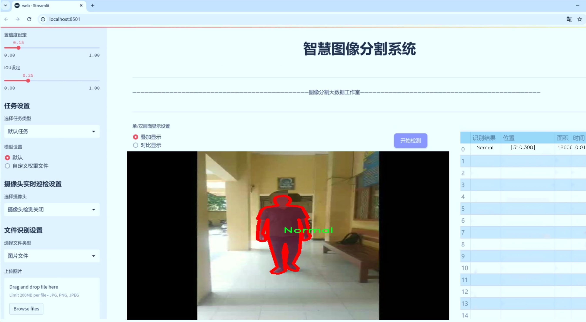
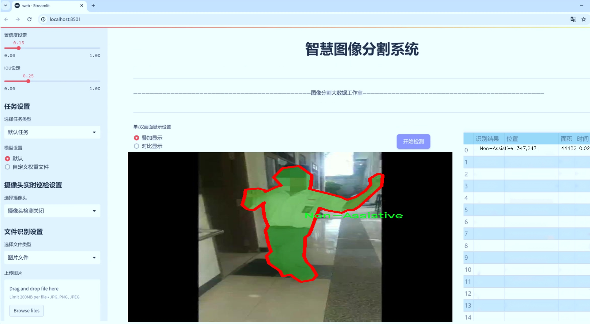
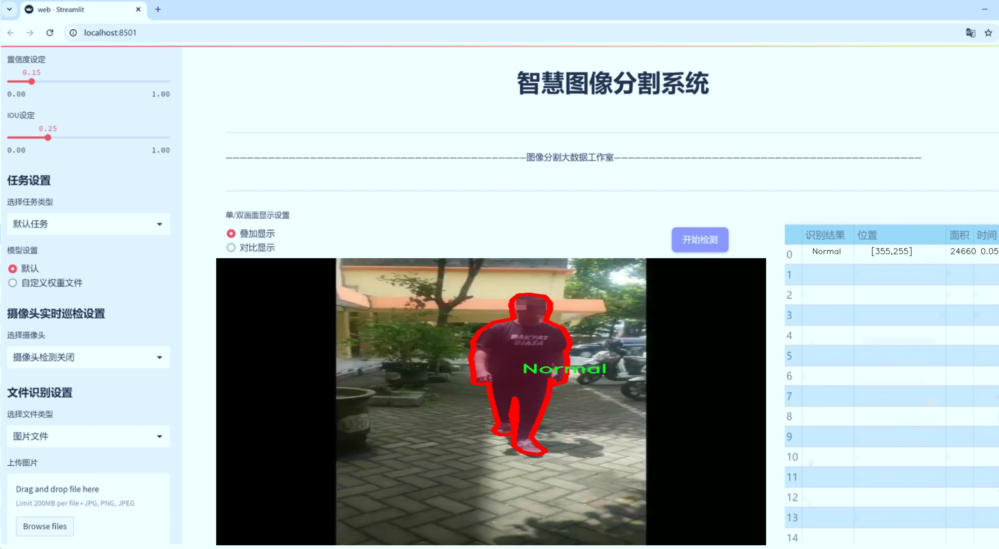
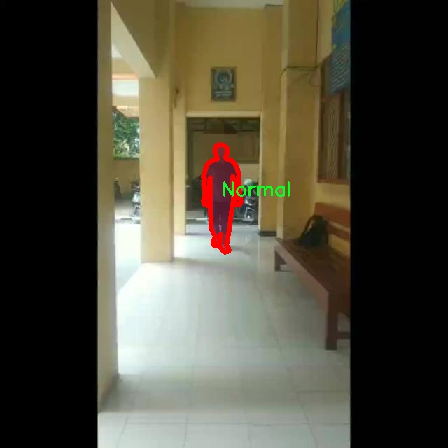
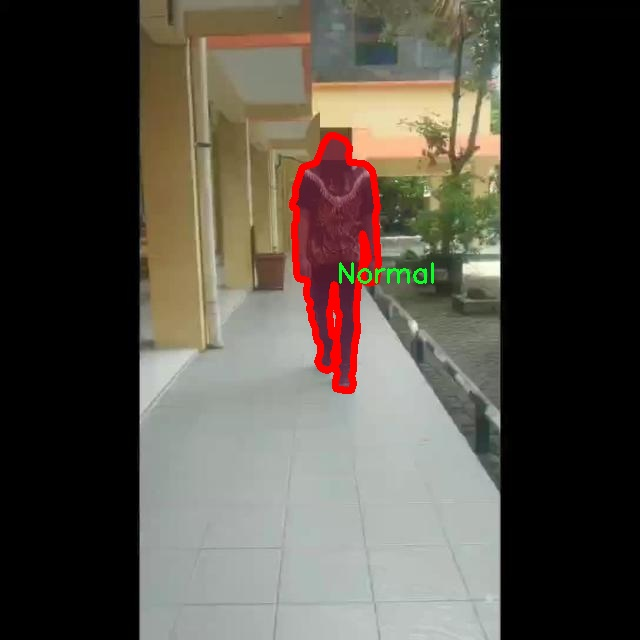
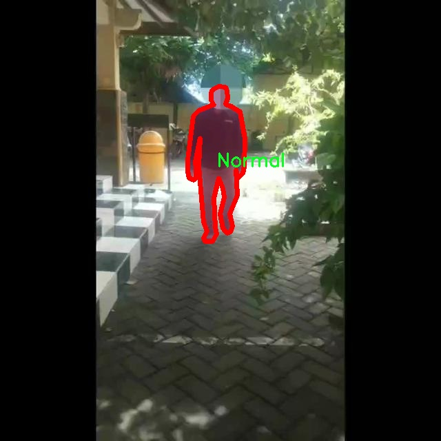
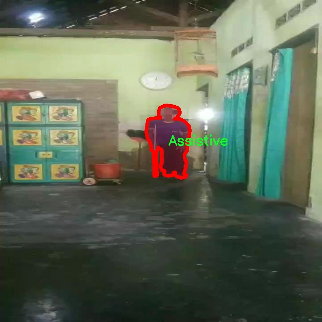
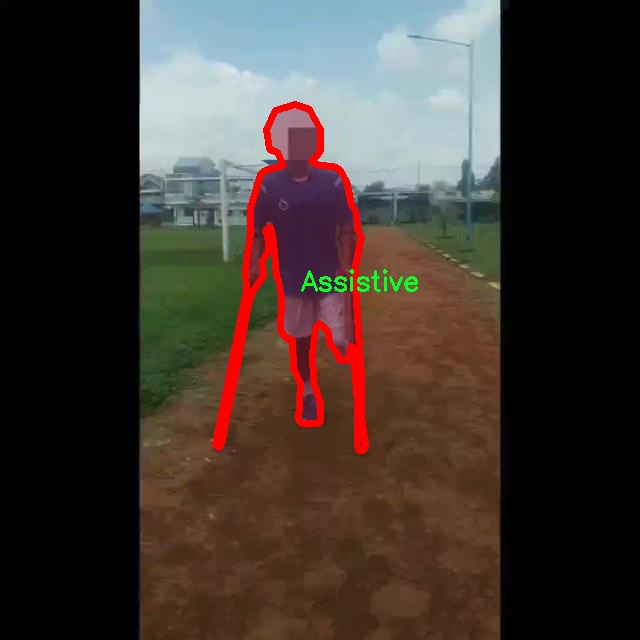

# 残障人士识别图像分割系统源码＆数据集分享
 [yolov8-seg-C2f-REPVGGOREPA＆yolov8-seg-C2f-Parc等50+全套改进创新点发刊_一键训练教程_Web前端展示]

### 1.研究背景与意义

项目参考[ILSVRC ImageNet Large Scale Visual Recognition Challenge](https://gitee.com/YOLOv8_YOLOv11_Segmentation_Studio/projects)

项目来源[AAAI Global Al lnnovation Contest](https://kdocs.cn/l/cszuIiCKVNis)

研究背景与意义

随着社会的不断发展，残障人士的生活质量和社会参与度日益受到重视。如何有效地识别和帮助残障人士，成为了社会科学、计算机科学及人工智能领域的重要研究课题。近年来，深度学习技术的迅猛发展为图像识别和分割提供了新的解决方案，尤其是YOLO（You Only Look Once）系列模型在目标检测和图像分割任务中表现出了优异的性能。YOLOv8作为该系列的最新版本，凭借其高效的计算能力和精确的识别能力，成为了实现残障人士识别的理想选择。

本研究旨在基于改进的YOLOv8模型，构建一个高效的残障人士识别图像分割系统。该系统不仅能够准确识别残障人士的身份，还能通过图像分割技术，区分出其所使用的辅助设备与非辅助设备。这一目标的实现，依赖于我们所使用的数据集——“Baru Lagi”，该数据集包含6200张图像，涵盖了三类目标：辅助设备（Assistive）、非辅助设备（Non-Assistive）和正常状态（Normal）。这些数据的多样性和丰富性为模型的训练和测试提供了坚实的基础。

在当前的研究背景下，残障人士的识别不仅是技术问题，更是社会问题。通过图像分割技术，我们能够更好地理解残障人士的需求，进而为其提供更为精准的服务和支持。例如，在公共场所，系统可以实时识别出残障人士及其使用的辅助设备，从而为其提供必要的帮助和便利。此外，该系统还可以为政策制定者提供数据支持，帮助他们更好地理解残障人士的生活状态与需求，进而推动相关政策的制定与实施。

从技术层面来看，YOLOv8模型的改进将主要集中在提高识别精度和处理速度上。通过引入更为先进的特征提取网络和优化算法，我们期望能够在保持高效性的同时，进一步提升模型对不同类别目标的识别能力。这一过程不仅能够推动计算机视觉技术的发展，也将为其他领域的应用提供借鉴。

综上所述，基于改进YOLOv8的残障人士识别图像分割系统的研究，具有重要的理论意义和实践价值。它不仅为残障人士的生活提供了技术支持，也为社会的包容性发展贡献了力量。通过这一研究，我们希望能够推动人工智能技术在社会服务领域的应用，提升残障人士的生活质量，促进社会的和谐与进步。

### 2.图片演示







##### 注意：由于此博客编辑较早，上面“2.图片演示”和“3.视频演示”展示的系统图片或者视频可能为老版本，新版本在老版本的基础上升级如下：（实际效果以升级的新版本为准）

  （1）适配了YOLOV8的“目标检测”模型和“实例分割”模型，通过加载相应的权重（.pt）文件即可自适应加载模型。

  （2）支持“图片识别”、“视频识别”、“摄像头实时识别”三种识别模式。

  （3）支持“图片识别”、“视频识别”、“摄像头实时识别”三种识别结果保存导出，解决手动导出（容易卡顿出现爆内存）存在的问题，识别完自动保存结果并导出到tempDir中。

  （4）支持Web前端系统中的标题、背景图等自定义修改，后面提供修改教程。

  另外本项目提供训练的数据集和训练教程,暂不提供权重文件（best.pt）,需要您按照教程进行训练后实现图片演示和Web前端界面演示的效果。

### 3.视频演示

[3.1 视频演示](https://www.bilibili.com/video/BV1YQD2YHEWv/)

### 4.数据集信息展示

##### 4.1 本项目数据集详细数据（类别数＆类别名）

nc: 3
names: ['Assistive', 'Non-Assistive', 'Normal']


##### 4.2 本项目数据集信息介绍

数据集信息展示

在现代计算机视觉领域，图像分割技术的进步为许多应用场景提供了强大的支持，尤其是在残障人士的识别与辅助技术中。为此，我们构建了一个名为“Baru Lagi”的数据集，旨在为改进YOLOv8-seg模型在残障人士识别图像分割任务中的表现提供高质量的训练数据。该数据集专注于三个主要类别，分别是“Assistive”（辅助设备）、“Non-Assistive”（非辅助设备）和“Normal”（正常状态），通过对这些类别的精确标注，我们希望能够提升模型在实际应用中的准确性和鲁棒性。

“Baru Lagi”数据集的设计理念是基于对残障人士日常生活中可能遇到的各种情境的深入理解。数据集中包含的“Assistive”类别主要涵盖了各种辅助设备的图像，如轮椅、助行器、听力辅助设备等。这些设备的存在不仅为残障人士提供了必要的支持，也在一定程度上提升了他们的生活质量。通过对这些图像的分割，模型能够更好地识别出辅助设备在环境中的位置，从而为后续的智能辅助系统提供重要的视觉信息。

与此同时，“Non-Assistive”类别则包括了一些与残障人士生活密切相关但并不直接提供辅助功能的物品和环境元素。例如，公共交通工具、无障碍设施等。这些元素虽然不属于辅助设备，但在残障人士的日常出行和生活中扮演着重要角色。通过对这些图像的标注和分割，模型能够更全面地理解残障人士所处的环境，进而提升对其需求的识别能力。

最后，“Normal”类别则代表了未受残障影响的普通场景和物体。这一类别的存在旨在为模型提供一个基准，以便更好地区分辅助和非辅助环境。这种对比不仅有助于提高模型的识别精度，还能在一定程度上减少误识别的发生率，使得最终的图像分割结果更加可靠。

整个“Baru Lagi”数据集的构建过程遵循了严格的标注标准，确保每一张图像都经过专业人员的审核与确认。数据集中的图像来源广泛，涵盖了不同的场景、光照条件和拍摄角度，以增强模型的泛化能力。此外，为了确保数据集的多样性和代表性，我们还考虑了不同地区和文化背景下的残障人士生活方式，力求在训练过程中充分反映现实世界的复杂性。

通过“Baru Lagi”数据集的训练，改进后的YOLOv8-seg模型将能够在图像分割任务中实现更高的准确性和效率。这不仅为残障人士的识别与辅助技术提供了坚实的基础，也为未来相关研究的深入开展奠定了良好的数据基础。我们相信，随着这一数据集的应用，残障人士的生活将会变得更加便利，社会对他们的关注和支持也将不断增强。











### 5.全套项目环境部署视频教程（零基础手把手教学）

[5.1 环境部署教程链接（零基础手把手教学）](https://www.bilibili.com/video/BV1jG4Ve4E9t/?vd_source=bc9aec86d164b67a7004b996143742dc)


[5.2 安装Python虚拟环境创建和依赖库安装视频教程链接（零基础手把手教学）](https://www.bilibili.com/video/BV1nA4VeYEze/?vd_source=bc9aec86d164b67a7004b996143742dc)

### 6.手把手YOLOV8-seg训练视频教程（零基础小白有手就能学会）

[6.1 手把手YOLOV8-seg训练视频教程（零基础小白有手就能学会）](https://www.bilibili.com/video/BV1cA4VeYETe/?vd_source=bc9aec86d164b67a7004b996143742dc)


按照上面的训练视频教程链接加载项目提供的数据集，运行train.py即可开始训练



     Epoch   gpu_mem       box       obj       cls    labels  img_size
     1/200     0G   0.01576   0.01955  0.007536        22      1280: 100%|██████████| 849/849 [14:42<00:00,  1.04s/it]
               Class     Images     Labels          P          R     mAP@.5 mAP@.5:.95: 100%|██████████| 213/213 [01:14<00:00,  2.87it/s]
                 all       3395      17314      0.994      0.957      0.0957      0.0843

     Epoch   gpu_mem       box       obj       cls    labels  img_size
     2/200     0G   0.01578   0.01923  0.007006        22      1280: 100%|██████████| 849/849 [14:44<00:00,  1.04s/it]
               Class     Images     Labels          P          R     mAP@.5 mAP@.5:.95: 100%|██████████| 213/213 [01:12<00:00,  2.95it/s]
                 all       3395      17314      0.996      0.956      0.0957      0.0845

     Epoch   gpu_mem       box       obj       cls    labels  img_size
     3/200     0G   0.01561    0.0191  0.006895        27      1280: 100%|██████████| 849/849 [10:56<00:00,  1.29it/s]
               Class     Images     Labels          P          R     mAP@.5 mAP@.5:.95: 100%|███████   | 187/213 [00:52<00:00,  4.04it/s]
                 all       3395      17314      0.996      0.957      0.0957      0.0845


### 7.50+种全套YOLOV8-seg创新点代码加载调参视频教程（一键加载写好的改进模型的配置文件）

[7.1 50+种全套YOLOV8-seg创新点代码加载调参视频教程（一键加载写好的改进模型的配置文件）](https://www.bilibili.com/video/BV1Hw4VePEXv/?vd_source=bc9aec86d164b67a7004b996143742dc)

### 8.YOLOV8-seg图像分割算法原理

原始YOLOv8-seg算法原理

YOLOv8-seg算法是由Ultralytics团队在YOLOv5的基础上发展而来的新一代目标检测与分割模型。自2023年1月发布以来，YOLOv8-seg不仅继承了YOLO系列模型的优良传统，还融合了近年来在计算机视觉领域取得的多项创新，旨在实现更高效、更精准的目标检测与分割任务。该算法的设计理念是以实时性和准确性为核心，适应多种应用场景，尤其是在资源受限的移动平台上表现出色。

YOLOv8-seg的网络结构依然遵循YOLO系列的经典架构，包括输入层、主干网络、特征融合层和解耦头部分。其输入层通过对图像进行预处理，将图像调整为640x640的RGB格式，随后将处理后的图像送入主干网络进行特征提取。与YOLOv5相比，YOLOv8-seg在主干网络中采用了C2f模块，取代了原有的C3模块。C2f模块的设计灵感来源于YOLOv7中的ELAN结构，增加了跳层连接的数量，从而提升了梯度流动的效率，减轻了深层网络中的梯度消失问题。这种设计不仅增强了特征提取的能力，还在一定程度上实现了模型的轻量化，使得YOLOv8-seg在保证精度的同时，能够更快地进行推理。

在特征融合层，YOLOv8-seg采用了PAN-FPN结构，进一步增强了多尺度特征的融合能力。该结构通过自下而上的特征融合和自上而下的特征传递，有效地结合了浅层、中层和高层特征，使得模型能够更好地捕捉到目标的细节信息和语义信息。这种深度融合的方式，确保了在不同分辨率下对目标的准确检测，尤其是在处理复杂场景时，YOLOv8-seg能够显著提高检测的鲁棒性。

在头部网络部分，YOLOv8-seg引入了解耦头的设计理念，采用了两个并行的分支来分别处理分类和回归任务。这种解耦设计使得分类和定位任务可以独立优化，分别关注于特征图中的类别相似性和边界框与真实框的关系。通过这种方式，YOLOv8-seg不仅提高了模型的收敛速度，还提升了最终的预测精度。此外，YOLOv8-seg摒弃了传统的锚框机制，转而采用无锚框结构，直接预测目标的中心位置。这一创新使得模型在处理小目标和密集目标时表现得更加灵活和高效。

为了进一步提升模型的性能，YOLOv8-seg在损失函数的设计上也进行了改进。采用了VFLLoss作为分类损失，并结合DFLLoss和CIoULoss作为回归损失，确保了分类和定位任务的平衡。特别是在样本匹配策略上，YOLOv8-seg采用了Task-Aligned的匹配方式，使得正负样本的划分更加合理，进而提高了模型在训练过程中的稳定性和准确性。

在数据增强方面，YOLOv8-seg摒弃了Mosaic数据增强的使用，认为虽然该方法在一定程度上提升了模型的鲁棒性，但也可能破坏数据的真实分布。相反，YOLOv8-seg在训练的最后10个epoch中停止使用Mosaic增强，旨在让模型更好地学习到真实场景中的特征。这一策略的实施，进一步增强了模型的泛化能力，使其在实际应用中表现得更加出色。

YOLOv8-seg在检测性能上取得了显著的进展，尤其是在COCO数据集上的表现，展示了其在不同尺寸模型下的优越性。通过对比其他YOLO系列模型，YOLOv8-seg在推理速度和精度上均表现出色，证明了其在实时目标检测和分割任务中的应用潜力。该模型的设计不仅考虑到了检测精度，也充分考虑了推理速度，确保其能够在资源受限的环境中高效运行。

总的来说，YOLOv8-seg算法通过对YOLO系列模型的多项创新和改进，形成了一种高效、精准的目标检测与分割解决方案。其在特征提取、特征融合、损失函数设计等多个方面的优化，使得YOLOv8-seg在处理复杂场景和多样化目标时，能够展现出更强的适应性和鲁棒性。随着YOLOv8-seg的不断发展和应用，预计将在计算机视觉领域带来新的突破和进展。


### 9.系统功能展示（检测对象为举例，实际内容以本项目数据集为准）

图9.1.系统支持检测结果表格显示

  图9.2.系统支持置信度和IOU阈值手动调节

  图9.3.系统支持自定义加载权重文件best.pt(需要你通过步骤5中训练获得)

  图9.4.系统支持摄像头实时识别

  图9.5.系统支持图片识别

  图9.6.系统支持视频识别

  图9.7.系统支持识别结果文件自动保存

  图9.8.系统支持Excel导出检测结果数据


### 10.50+种全套YOLOV8-seg创新点原理讲解（非科班也可以轻松写刊发刊，V11版本正在科研待更新）

#### 10.1 由于篇幅限制，每个创新点的具体原理讲解就不一一展开，具体见下列网址中的创新点对应子项目的技术原理博客网址【Blog】：


[10.1 50+种全套YOLOV8-seg创新点原理讲解链接](https://gitee.com/qunmasj/good)

#### 10.2 部分改进模块原理讲解(完整的改进原理见上图和技术博客链接)【如果此小节的图加载失败可以通过CSDN或者Github搜索该博客的标题访问原始博客，原始博客图片显示正常】
### YOLOv8简介
#### Neck模块设计
骨干网络和 Neck 的具体变化为：

第一个卷积层的 kernel 从 6x6 变成了 3x3
所有的 C3 模块换成 C2f，结构如下所示，可以发现多了更多的跳层连接和额外的 Split 操作


去掉了 Neck 模块中的 2 个卷积连接层
Backbone 中 C2f 的 block 数从 3-6-9-3 改成了 3-6-6-3
查看 N/S/M/L/X 等不同大小模型，可以发现 N/S 和 L/X 两组模型只是改了缩放系数，但是 S/M/L 等骨干网络的通道数设置不一样，没有遵循同一套缩放系数。如此设计的原因应该是同一套缩放系数下的通道设置不是最优设计，YOLOv7 网络设计时也没有遵循一套缩放系数作用于所有模型。

#### Head模块设计
Head 部分变化最大，从原先的耦合头变成了解耦头，并且从 YOLOv5 的 Anchor-Based 变成了 Anchor-Free。其结构如下所示：


可以看出，不再有之前的 objectness 分支，只有解耦的分类和回归分支，并且其回归分支使用了 Distribution Focal Loss 中提出的积分形式表示法。

#### Loss 计算
Loss 计算过程包括 2 个部分： 正负样本分配策略和 Loss 计算。 现代目标检测器大部分都会在正负样本分配策略上面做文章，典型的如 YOLOX 的 simOTA、TOOD 的 TaskAlignedAssigner 和 RTMDet 的 DynamicSoftLabelAssigner，这类 Assigner 大都是动态分配策略，而 YOLOv5 采用的依然是静态分配策略。考虑到动态分配策略的优异性，YOLOv8 算法中则直接引用了 TOOD 的 TaskAlignedAssigner。 TaskAlignedAssigner 的匹配策略简单总结为： 根据分类与回归的分数加权的分数选择正样本。

s 是标注类别对应的预测分值，u 是预测框和 gt 框的 iou，两者相乘就可以衡量对齐程度。

对于每一个 GT，对所有的预测框基于 GT 类别对应分类分数，预测框与 GT 的 IoU 的加权得到一个关联分类以及回归的对齐分数 alignment_metrics 。
对于每一个 GT，直接基于 alignment_metrics 对齐分数选取 topK 大的作为正样本
Loss 计算包括 2 个分支： 分类和回归分支，没有了之前的 objectness 分支。
分类分支依然采用 BCE Loss
回归分支需要和 Distribution Focal Loss 中提出的积分形式表示法绑定，因此使用了 Distribution Focal Loss， 同时还使用了 CIoU Loss
Loss 采用一定权重比例加权即可。
#### 训练数据增强
数据增强方面和 YOLOv5 差距不大，只不过引入了 YOLOX 中提出的最后 10 个 epoch 关闭 Mosaic 的操作。假设训练 epoch 是 500，其示意图如下所示：

### RCS-OSA的基本原理
参考该博客，RCSOSA（RCS-One-Shot Aggregation）是RCS-YOLO中提出的一种结构，我们可以将主要原理概括如下：

1. RCS（Reparameterized Convolution based on channel Shuffle）: 结合了通道混洗，通过重参数化卷积来增强网络的特征提取能力。

2. RCS模块: 在训练阶段，利用多分支结构学习丰富的特征表示；在推理阶段，通过结构化重参数化简化为单一分支，减少内存消耗。

3. OSA（One-Shot Aggregation）: 一次性聚合多个特征级联，减少网络计算负担，提高计算效率。

4. 特征级联: RCS-OSA模块通过堆叠RCS，确保特征的复用并加强不同层之间的信息流动。

#### RCS
RCS（基于通道Shuffle的重参数化卷积）是RCS-YOLO的核心组成部分，旨在训练阶段通过多分支结构学习丰富的特征信息，并在推理阶段通过简化为单分支结构来减少内存消耗，实现快速推理。此外，RCS利用通道分割和通道Shuffle操作来降低计算复杂性，同时保持通道间的信息交换，这样在推理阶段相比普通的3×3卷积可以减少一半的计算复杂度。通过结构重参数化，RCS能够在训练阶段从输入特征中学习深层表示，并在推理阶段实现快速推理，同时减少内存消耗。

#### RCS模块
RCS（基于通道Shuffle的重参数化卷积）模块中，结构在训练阶段使用多个分支，包括1x1和3x3的卷积，以及一个直接的连接（Identity），用于学习丰富的特征表示。在推理阶段，结构被重参数化成一个单一的3x3卷积，以减少计算复杂性和内存消耗，同时保持训练阶段学到的特征表达能力。这与RCS的设计理念紧密相连，即在不牺牲性能的情况下提高计算效率。


上图为大家展示了RCS的结构，分为训练阶段（a部分）和推理阶段（b部分）。在训练阶段，输入通过通道分割，一部分输入经过RepVGG块，另一部分保持不变。然后通过1x1卷积和3x3卷积处理RepVGG块的输出，与另一部分输入进行通道Shuffle和连接。在推理阶段，原来的多分支结构被简化为一个单一的3x3 RepConv块。这种设计允许在训练时学习复杂特征，在推理时减少计算复杂度。黑色边框的矩形代表特定的模块操作，渐变色的矩形代表张量的特定特征，矩形的宽度代表张量的通道数。 

#### OSA
OSA（One-Shot Aggregation）是一个关键的模块，旨在提高网络在处理密集连接时的效率。OSA模块通过表示具有多个感受野的多样化特征，并在最后的特征映射中仅聚合一次所有特征，从而克服了DenseNet中密集连接的低效率问题。

OSA模块的使用有两个主要目的：

1. 提高特征表示的多样性：OSA通过聚合具有不同感受野的特征来增加网络对于不同尺度的敏感性，这有助于提升模型对不同大小目标的检测能力。

2. 提高效率：通过在网络的最后一部分只进行一次特征聚合，OSA减少了重复的特征计算和存储需求，从而提高了网络的计算和能源效率。

在RCS-YOLO中，OSA模块被进一步与RCS（基于通道Shuffle的重参数化卷积）相结合，形成RCS-OSA模块。这种结合不仅保持了低成本的内存消耗，而且还实现了语义信息的有效提取，对于构建轻量级和大规模的对象检测器尤为重要。

下面我将为大家展示RCS-OSA（One-Shot Aggregation of RCS）的结构。


在RCS-OSA模块中，输入被分为两部分，一部分直接通过，另一部分通过堆叠的RCS模块进行处理。处理后的特征和直接通过的特征在通道混洗（Channel Shuffle）后合并。这种结构设计用于增强模型的特征提取和利用效率，是RCS-YOLO架构中的一个关键组成部分旨在通过一次性聚合来提高模型处理特征的能力，同时保持计算效率。

#### 特征级联
特征级联（feature cascade）是一种技术，通过在网络的一次性聚合（one-shot aggregate）路径上维持有限数量的特征级联来实现的。在RCS-YOLO中，特别是在RCS-OSA（RCS-Based One-Shot Aggregation）模块中，只保留了三个特征级联。

特征级联的目的是为了减轻网络计算负担并降低内存占用。这种方法可以有效地聚合不同层次的特征，提高模型的语义信息提取能力，同时避免了过度复杂化网络结构所带来的低效率和高资源消耗。

下面为大家提供的图像展示的是RCS-YOLO的整体架构，其中包括RCS-OSA模块。RCS-OSA在模型中用于堆叠RCS模块，以确保特征的复用并加强不同层之间的信息流动。图中显示的多层RCS-OSA模块的排列和组合反映了它们如何一起工作以优化特征传递和提高检测性能。


总结：RCS-YOLO主要由RCS-OSA（蓝色模块）和RepVGG（橙色模块）构成。这里的n代表堆叠RCS模块的数量。n_cls代表检测到的对象中的类别数量。图中的IDetect是从YOLOv7中借鉴过来的，表示使用二维卷积神经网络的检测层。这个架构通过堆叠的RCS模块和RepVGG模块，以及两种类型的检测层，实现了对象检测的任务。 


### 11.项目核心源码讲解（再也不用担心看不懂代码逻辑）

#### 11.1 ultralytics\solutions\object_counter.py

以下是经过简化和注释的核心代码部分，保留了最重要的功能和逻辑：

```python
# 导入必要的库
from collections import defaultdict
import cv2
from shapely.geometry import Polygon, Point
from ultralytics.utils.plotting import Annotator, colors

class ObjectCounter:
    """用于实时视频流中对象计数的类。"""

    def __init__(self):
        """初始化计数器的默认值。"""
        # 鼠标事件相关
        self.is_drawing = False  # 是否正在绘制
        self.selected_point = None  # 选中的点

        # 区域信息
        self.reg_pts = None  # 区域的点
        self.counting_region = None  # 计数区域
        self.region_color = (255, 255, 255)  # 区域颜色

        # 图像和注释信息
        self.im0 = None  # 当前图像
        self.annotator = None  # 注释器

        # 对象计数信息
        self.in_counts = 0  # 进入计数
        self.out_counts = 0  # 离开计数
        self.counting_list = []  # 计数列表

        # 跟踪信息
        self.track_history = defaultdict(list)  # 跟踪历史
        self.track_thickness = 2  # 跟踪线厚度
        self.draw_tracks = False  # 是否绘制跟踪线

    def set_args(self, classes_names, reg_pts, region_color=None, line_thickness=2, track_thickness=2, view_img=False, draw_tracks=False):
        """
        配置计数器的参数，包括类名、区域点、颜色等。

        Args:
            classes_names (dict): 类别名称
            reg_pts (list): 定义计数区域的点
            region_color (tuple): 区域线的颜色
            line_thickness (int): 边界框的线厚度
            track_thickness (int): 跟踪线的厚度
            view_img (bool): 是否显示视频流
            draw_tracks (bool): 是否绘制跟踪
        """
        self.reg_pts = reg_pts  # 设置区域点
        self.counting_region = Polygon(self.reg_pts)  # 创建计数区域多边形
        self.names = classes_names  # 设置类名
        self.region_color = region_color if region_color else self.region_color  # 设置区域颜色
        self.view_img = view_img  # 设置是否显示图像
        self.track_thickness = track_thickness  # 设置跟踪线厚度
        self.draw_tracks = draw_tracks  # 设置是否绘制跟踪线

    def extract_and_process_tracks(self, tracks):
        """
        提取并处理跟踪数据，更新计数和绘制注释。

        Args:
            tracks (list): 从对象跟踪过程中获得的跟踪数据。
        """
        boxes = tracks[0].boxes.xyxy.cpu()  # 获取边界框
        clss = tracks[0].boxes.cls.cpu().tolist()  # 获取类别
        track_ids = tracks[0].boxes.id.int().cpu().tolist()  # 获取跟踪ID

        self.annotator = Annotator(self.im0, 2, self.names)  # 初始化注释器
        self.annotator.draw_region(reg_pts=self.reg_pts, color=(0, 255, 0))  # 绘制计数区域

        for box, track_id, cls in zip(boxes, track_ids, clss):
            self.annotator.box_label(box, label=self.names[cls], color=colors(int(cls), True))  # 绘制边界框

            # 更新跟踪历史
            track_line = self.track_history[track_id]
            track_line.append((float((box[0] + box[2]) / 2), float((box[1] + box[3]) / 2)))  # 添加中心点
            if len(track_line) > 30:
                track_line.pop(0)  # 保持跟踪点数量不超过30

            # 计数对象
            if self.counting_region.contains(Point(track_line[-1])):  # 检查是否在计数区域内
                if track_id not in self.counting_list:  # 如果是新对象
                    self.counting_list.append(track_id)  # 添加到计数列表
                    if box[0] < self.counting_region.centroid.x:  # 判断是进入还是离开
                        self.out_counts += 1
                    else:
                        self.in_counts += 1

        # 显示计数信息
        if self.view_img:
            incount_label = 'InCount : ' + f'{self.in_counts}'
            outcount_label = 'OutCount : ' + f'{self.out_counts}'
            self.annotator.count_labels(in_count=incount_label, out_count=outcount_label)  # 显示计数标签
            cv2.imshow('Ultralytics YOLOv8 Object Counter', self.im0)  # 显示图像
            if cv2.waitKey(1) & 0xFF == ord('q'):  # 按'q'退出
                return

    def start_counting(self, im0, tracks):
        """
        启动对象计数过程。

        Args:
            im0 (ndarray): 当前视频流帧。
            tracks (list): 从对象跟踪过程中获得的跟踪数据。
        """
        self.im0 = im0  # 存储当前图像
        if tracks[0].boxes.id is None:  # 如果没有跟踪ID，返回
            return
        self.extract_and_process_tracks(tracks)  # 提取并处理跟踪数据

if __name__ == '__main__':
    ObjectCounter()  # 创建对象计数器实例
```

### 代码分析
1. **类的定义**：`ObjectCounter`类用于管理实时视频流中的对象计数。
2. **初始化方法**：设置一些基本参数，包括鼠标事件、区域信息、图像信息和计数信息。
3. **参数设置方法**：`set_args`方法用于配置计数器的各种参数，如区域点、颜色、线厚度等。
4. **提取和处理跟踪数据**：`extract_and_process_tracks`方法用于处理跟踪数据，更新计数并绘制注释。
5. **计数逻辑**：通过判断对象的中心点是否在计数区域内来更新进入和离开的计数。
6. **显示图像**：在设置为显示图像时，更新并显示当前帧和计数信息。
7. **启动计数**：`start_counting`方法是主入口，负责接收当前帧和跟踪数据并调用处理方法。

这个文件定义了一个名为 `ObjectCounter` 的类，用于在实时视频流中基于物体的轨迹进行计数。该类的设计旨在跟踪进入和离开指定区域的物体数量。首先，文件导入了一些必要的库，包括 `cv2`（OpenCV）用于图像处理，`defaultdict` 用于存储轨迹信息，以及 `shapely` 库用于处理几何形状。

在 `ObjectCounter` 类的构造函数中，初始化了一些默认值，包括鼠标事件的状态、选定的点、计数区域的信息、图像和注释信息、物体计数信息以及轨迹信息。具体来说，`is_drawing` 用于指示是否正在绘制区域，`selected_point` 用于存储当前选中的点，`reg_pts` 存储计数区域的点，`counting_region` 是一个多边形对象，表示计数区域。

类中有一个 `set_args` 方法，用于配置计数器的参数，包括类名、区域点、区域颜色、线条厚度等。这些参数将影响后续的物体计数和可视化效果。

`mouse_event_for_region` 方法用于处理鼠标事件，使用户能够通过鼠标交互来调整计数区域。具体来说，当用户按下鼠标左键时，如果鼠标位置接近某个区域点，则选中该点；在鼠标移动时，如果正在绘制，则更新选中点的位置；当用户释放鼠标左键时，停止绘制。

`extract_and_process_tracks` 方法是处理物体轨迹的核心。它从输入的轨迹中提取边界框、类别和轨迹ID，并使用 `Annotator` 类进行可视化。对于每个物体，首先绘制边界框，然后更新轨迹信息，并根据物体的中心点是否在计数区域内来进行计数。物体进入和离开计数区域的数量分别用 `in_counts` 和 `out_counts` 变量进行统计。

最后，如果设置了显示图像的标志，程序会在窗口中显示当前的计数信息，并允许用户通过鼠标事件来调整计数区域。`start_counting` 方法是启动计数过程的主函数，它接收当前帧图像和物体轨迹，并调用处理方法进行计数。

整体而言，这个文件实现了一个实时物体计数的功能，能够通过用户交互来定义计数区域，并在视频流中动态更新计数结果。

#### 11.2 ultralytics\nn\tasks.py

以下是代码中最核心的部分，并附上详细的中文注释：

```python
import torch
import torch.nn as nn

class BaseModel(nn.Module):
    """BaseModel类是Ultralytics YOLO系列模型的基类。"""

    def forward(self, x, *args, **kwargs):
        """
        模型的前向传播方法，处理单个尺度的输入。

        参数:
            x (torch.Tensor | dict): 输入图像张量或包含图像张量和真实标签的字典。

        返回:
            (torch.Tensor): 网络的输出。
        """
        if isinstance(x, dict):  # 处理训练和验证时的情况
            return self.loss(x, *args, **kwargs)  # 计算损失
        return self.predict(x, *args, **kwargs)  # 进行预测

    def predict(self, x, profile=False, visualize=False, augment=False):
        """
        通过网络进行前向传播。

        参数:
            x (torch.Tensor): 输入张量。
            profile (bool): 如果为True，打印每层的计算时间，默认为False。
            visualize (bool): 如果为True，保存模型的特征图，默认为False。
            augment (bool): 在预测时进行图像增强，默认为False。

        返回:
            (torch.Tensor): 模型的最后输出。
        """
        if augment:
            return self._predict_augment(x)  # 进行增强预测
        return self._predict_once(x, profile, visualize)  # 进行一次预测

    def _predict_once(self, x, profile=False, visualize=False):
        """
        执行一次前向传播。

        参数:
            x (torch.Tensor): 输入张量。
            profile (bool): 如果为True，打印每层的计算时间，默认为False。
            visualize (bool): 如果为True，保存模型的特征图，默认为False。

        返回:
            (torch.Tensor): 模型的最后输出。
        """
        y, dt = [], []  # 输出列表和时间列表
        for m in self.model:  # 遍历模型中的每一层
            if m.f != -1:  # 如果不是来自前一层
                x = y[m.f] if isinstance(m.f, int) else [x if j == -1 else y[j] for j in m.f]  # 从早期层获取输入
            if profile:
                self._profile_one_layer(m, x, dt)  # 记录当前层的计算时间
            x = m(x)  # 执行前向传播
            y.append(x if m.i in self.save else None)  # 保存输出
            if visualize:
                feature_visualization(x, m.type, m.i, save_dir=visualize)  # 可视化特征图
        return x  # 返回最后的输出

    def loss(self, batch, preds=None):
        """
        计算损失。

        参数:
            batch (dict): 用于计算损失的批次数据。
            preds (torch.Tensor | List[torch.Tensor]): 预测结果。

        返回:
            (torch.Tensor): 计算得到的损失值。
        """
        if not hasattr(self, 'criterion'):
            self.criterion = self.init_criterion()  # 初始化损失函数

        preds = self.forward(batch['img']) if preds is None else preds  # 获取预测结果
        return self.criterion(preds, batch)  # 计算损失

    def init_criterion(self):
        """初始化BaseModel的损失标准。"""
        raise NotImplementedError('compute_loss() needs to be implemented by task heads')


class DetectionModel(BaseModel):
    """YOLOv8检测模型。"""

    def __init__(self, cfg='yolov8n.yaml', ch=3, nc=None, verbose=True):
        """使用给定的配置和参数初始化YOLOv8检测模型。"""
        super().__init__()
        self.yaml = cfg if isinstance(cfg, dict) else yaml_model_load(cfg)  # 加载配置字典

        # 定义模型
        ch = self.yaml['ch'] = self.yaml.get('ch', ch)  # 输入通道
        if nc and nc != self.yaml['nc']:
            self.yaml['nc'] = nc  # 覆盖YAML中的类别数
        self.model, self.save = parse_model(deepcopy(self.yaml), ch=ch, verbose=verbose)  # 解析模型
        self.names = {i: f'{i}' for i in range(self.yaml['nc'])}  # 默认名称字典

        # 初始化权重和偏置
        initialize_weights(self)

    def init_criterion(self):
        """初始化DetectionModel的损失标准。"""
        return v8DetectionLoss(self)  # 返回YOLOv8检测损失

# 省略其他模型类和辅助函数...
```

### 代码核心部分说明：
1. **BaseModel类**：这是所有YOLO模型的基类，定义了模型的基本结构和前向传播逻辑，包括损失计算的接口。
2. **forward方法**：处理输入数据，决定是进行预测还是计算损失。
3. **predict方法**：实现模型的前向传播，可以选择进行数据增强和可视化。
4. **loss方法**：计算模型的损失，依赖于特定的损失标准。
5. **DetectionModel类**：继承自BaseModel，专门用于YOLOv8的检测任务，负责模型的初始化和损失标准的定义。

通过这些核心部分，模型能够接收输入数据，进行前向传播，计算损失，并且可以根据不同的任务类型（如检测、分割、分类等）进行扩展。

这个程序文件是Ultralytics YOLO（You Only Look Once）模型的一个核心部分，主要定义了不同类型的模型类和相关功能。文件的结构包括多个类和函数，旨在实现目标检测、图像分割、姿态估计和分类等任务。

首先，文件导入了一些必要的库和模块，包括PyTorch、Ultralytics的自定义模块以及其他辅助工具。然后，定义了一个基础模型类`BaseModel`，它继承自`nn.Module`，为所有YOLO模型提供了基础功能。该类实现了前向传播方法`forward`，根据输入类型决定是进行损失计算还是预测。它还定义了多个辅助方法，例如`predict`、`fuse`和`load`，用于处理模型的预测、层融合和权重加载等操作。

接下来，文件定义了多个特定模型类，如`DetectionModel`、`SegmentationModel`、`PoseModel`和`ClassificationModel`，这些类都继承自`BaseModel`。每个模型类都有其特定的初始化方法和损失计算方法。例如，`DetectionModel`类用于YOLOv8的目标检测，初始化时会解析配置文件并构建模型结构，同时定义了特定的损失函数`v8DetectionLoss`。

在`DetectionModel`类中，`_predict_augment`方法实现了对输入图像的增强处理，并返回增强后的推理结果。`SegmentationModel`和`PoseModel`类则分别用于图像分割和姿态估计，重写了初始化损失函数的方法，以适应各自的任务需求。

此外，文件还定义了一个`Ensemble`类，用于模型的集成，能够将多个模型的输出结合起来，以提高预测的准确性。`temporary_modules`函数是一个上下文管理器，用于在运行时临时添加或修改模块，方便代码重构和兼容性处理。

文件中还包含了一些实用的函数，例如`torch_safe_load`用于安全加载PyTorch模型，`attempt_load_weights`和`attempt_load_one_weight`用于加载模型权重，`parse_model`用于解析YOLO模型的配置文件，`yaml_model_load`用于从YAML文件加载模型配置。

最后，文件提供了一些工具函数，用于推测模型的任务类型和模型规模，这些功能有助于用户在使用模型时进行正确的配置和调用。

总体而言，这个文件是Ultralytics YOLO模型的核心实现部分，涵盖了模型的定义、训练、推理及相关工具，旨在为用户提供一个高效、灵活的目标检测和计算机视觉解决方案。

#### 11.3 ultralytics\models\fastsam\__init__.py

以下是代码中最核心的部分，并附上详细的中文注释：

```python
# 导入必要的模块和类
from .model import FastSAM  # 从当前包的model模块导入FastSAM类
from .predict import FastSAMPredictor  # 从当前包的predict模块导入FastSAMPredictor类
from .prompt import FastSAMPrompt  # 从当前包的prompt模块导入FastSAMPrompt类
from .val import FastSAMValidator  # 从当前包的val模块导入FastSAMValidator类

# 定义当前模块的公开接口
__all__ = 'FastSAMPredictor', 'FastSAM', 'FastSAMPrompt', 'FastSAMValidator'
```

### 详细注释说明：

1. **模块导入**：
   - `from .model import FastSAM`：从当前包的 `model` 模块中导入 `FastSAM` 类，`FastSAM` 可能是一个模型类，用于实现某种功能或算法。
   - `from .predict import FastSAMPredictor`：从当前包的 `predict` 模块中导入 `FastSAMPredictor` 类，通常用于对输入数据进行预测。
   - `from .prompt import FastSAMPrompt`：从当前包的 `prompt` 模块中导入 `FastSAMPrompt` 类，可能用于处理用户输入或提示。
   - `from .val import FastSAMValidator`：从当前包的 `val` 模块中导入 `FastSAMValidator` 类，通常用于验证模型的性能或结果。

2. **公开接口定义**：
   - `__all__` 是一个特殊变量，用于定义当前模块的公开接口。当使用 `from module import *` 时，只有在 `__all__` 中列出的名称会被导入。这有助于控制模块的可见性和避免名称冲突。

通过这些导入和定义，模块提供了几个核心功能类，供其他模块或脚本使用。

这个程序文件是一个Python模块的初始化文件，位于`ultralytics/models/fastsam`目录下。它的主要功能是导入该模块中定义的类和函数，并指定了公共接口。

首先，文件开头有一行注释，表明该项目是Ultralytics YOLO的一部分，并且遵循AGPL-3.0许可证。这说明该代码是开源的，用户可以自由使用和修改，但需要遵循相应的许可证条款。

接下来，文件通过相对导入的方式引入了四个组件：`FastSAM`、`FastSAMPredictor`、`FastSAMPrompt`和`FastSAMValidator`。这些组件分别定义在同一模块的不同文件中。具体来说：

- `FastSAM`：可能是该模块的核心类，负责实现FastSAM算法的主要功能。
- `FastSAMPredictor`：这个类可能用于进行预测，利用FastSAM模型对输入数据进行处理并输出结果。
- `FastSAMPrompt`：这个类可能涉及到与用户交互的功能，比如提供输入提示或指令。
- `FastSAMValidator`：这个类可能用于验证模型的性能或结果，确保输出的准确性和可靠性。

最后，`__all__`变量定义了模块的公共接口，指定了在使用`from module import *`语句时，哪些名称是可以被导入的。这里列出的四个类都被包含在内，意味着它们是模块的主要功能部分，用户可以直接使用这些类而无需了解模块内部的实现细节。

总体而言，这个初始化文件的作用是将FastSAM模型相关的功能模块化，并提供一个清晰的接口供外部使用。

#### 11.4 web.py

以下是经过简化并添加详细中文注释的核心代码部分：

```python
import cv2
import numpy as np
from PIL import ImageFont, ImageDraw, Image
from hashlib import md5

def calculate_polygon_area(points):
    """
    计算多边形的面积，输入应为一个 Nx2 的numpy数组，表示多边形的顶点坐标
    """
    if len(points) < 3:  # 多边形至少需要3个顶点
        return 0
    return cv2.contourArea(points)

def draw_with_chinese(image, text, position, font_size=20, color=(255, 0, 0)):
    """
    在OpenCV图像上绘制中文文字
    """
    # 将图像从 OpenCV 格式（BGR）转换为 PIL 格式（RGB）
    image_pil = Image.fromarray(cv2.cvtColor(image, cv2.COLOR_BGR2RGB))
    draw = ImageDraw.Draw(image_pil)
    # 使用指定的字体
    font = ImageFont.truetype("simsun.ttc", font_size, encoding="unic")
    draw.text(position, text, font=font, fill=color)
    # 将图像从 PIL 格式（RGB）转换回 OpenCV 格式（BGR）
    return cv2.cvtColor(np.array(image_pil), cv2.COLOR_RGB2BGR)

def generate_color_based_on_name(name):
    """
    使用哈希函数生成稳定的颜色
    """
    hash_object = md5(name.encode())
    hex_color = hash_object.hexdigest()[:6]  # 取前6位16进制数
    r, g, b = int(hex_color[0:2], 16), int(hex_color[2:4], 16), int(hex_color[4:6], 16)
    return (b, g, r)  # OpenCV 使用BGR格式

def draw_detections(image, info, alpha=0.2):
    """
    在图像上绘制检测结果，包括边界框和中文标签
    """
    name, bbox = info['class_name'], info['bbox']
    x1, y1, x2, y2 = bbox
    # 绘制边界框
    cv2.rectangle(image, (x1, y1), (x2, y2), color=(0, 0, 255), thickness=3)
    # 绘制中文标签
    image = draw_with_chinese(image, name, (x1, y1 - 10), font_size=20)
    return image

def frame_process(image, model, conf_threshold=0.15, iou_threshold=0.5):
    """
    处理并预测单个图像帧的内容。
    Args:
        image (numpy.ndarray): 输入的图像。
        model: 预测模型。
        conf_threshold (float): 置信度阈值。
        iou_threshold (float): IOU阈值。
    Returns:
        tuple: 处理后的图像，检测信息。
    """
    pre_img = model.preprocess(image)  # 对图像进行预处理
    params = {'conf': conf_threshold, 'iou': iou_threshold}
    model.set_param(params)  # 更新模型参数

    pred = model.predict(pre_img)  # 使用模型进行预测
    detInfo = []  # 初始化检测信息列表

    if pred is not None and len(pred):
        for info in pred:  # 遍历检测到的对象
            image = draw_detections(image, info)  # 绘制检测结果
            detInfo.append(info)  # 记录检测信息

    return image, detInfo

# 示例使用
if __name__ == "__main__":
    # 加载模型和图像
    model = ...  # 假设已加载模型
    image = cv2.imread("path_to_image.jpg")  # 读取图像

    # 处理图像并获取检测结果
    processed_image, detections = frame_process(image, model)

    # 显示结果
    cv2.imshow("Detections", processed_image)
    cv2.waitKey(0)
    cv2.destroyAllWindows()
```

### 代码注释说明：
1. **calculate_polygon_area**: 计算多边形的面积，确保至少有三个顶点。
2. **draw_with_chinese**: 在图像上绘制中文文本，使用PIL库处理字体。
3. **generate_color_based_on_name**: 根据名称生成稳定的颜色，使用MD5哈希。
4. **draw_detections**: 在图像上绘制检测框和标签。
5. **frame_process**: 处理图像，进行预测并返回处理后的图像和检测信息。

### 主要功能：
- 该代码段实现了图像检测的基本功能，包括计算多边形面积、绘制中文文本、生成颜色、绘制检测结果以及处理图像帧。

这个程序文件 `web.py` 是一个基于 Streamlit 的图像分割和目标检测系统，主要用于实时处理摄像头输入或上传的图像和视频文件。程序的核心功能包括目标检测、绘制检测框、显示检测结果以及保存检测日志。

首先，程序导入了多个必要的库，包括用于图像处理的 OpenCV 和 NumPy，Streamlit 用于构建用户界面，以及其他一些自定义模块和工具函数。程序定义了一些辅助函数，例如计算多边形面积、在图像上绘制中文文本、生成基于名称的颜色等。这些函数在后续的图像处理和结果展示中起到了重要作用。

`Detection_UI` 类是程序的核心，负责初始化检测系统的参数和界面。构造函数中，类实例化了一些变量，包括模型类型、置信度阈值、IOU 阈值、上传的文件、检测结果等。同时，它还设置了页面的布局和样式，加载可用的摄像头列表，并初始化模型。

在 `setup_sidebar` 方法中，程序设置了侧边栏的内容，包括置信度和 IOU 阈值的滑动条、模型选择下拉框、摄像头选择和文件上传功能。用户可以通过这些控件来配置检测参数和选择输入源。

`process_camera_or_file` 方法是程序的核心处理逻辑，根据用户选择的输入源（摄像头、图片或视频文件）进行相应的处理。如果选择了摄像头，程序会实时捕获视频流并进行目标检测；如果上传了文件，则会对文件进行处理并显示检测结果。

在处理每一帧图像时，程序会调用 `frame_process` 方法，该方法负责对输入图像进行预处理、使用模型进行预测，并绘制检测框和标签。检测结果会被记录并显示在表格中，用户可以通过下拉框选择不同的目标进行过滤。

此外，程序还提供了保存检测结果的功能，用户可以将检测日志导出为 CSV 文件，方便后续查看和分析。

最后，程序通过 `if __name__ == "__main__":` 语句实例化 `Detection_UI` 类并运行应用，启动整个检测系统的界面和功能。整体上，这个程序实现了一个功能完整的图像分割和目标检测系统，具有良好的用户交互体验和实时处理能力。

#### 11.5 ultralytics\data\build.py

以下是代码中最核心的部分，并附上详细的中文注释：

```python
import os
import random
import numpy as np
import torch
from torch.utils.data import dataloader, distributed
from .dataset import YOLODataset
from .utils import PIN_MEMORY

class InfiniteDataLoader(dataloader.DataLoader):
    """
    无限数据加载器，重用工作线程。

    该类继承自 PyTorch 的 DataLoader，支持无限循环读取数据。
    """

    def __init__(self, *args, **kwargs):
        """初始化无限数据加载器，重写 batch_sampler 为 _RepeatSampler。"""
        super().__init__(*args, **kwargs)
        object.__setattr__(self, 'batch_sampler', _RepeatSampler(self.batch_sampler))
        self.iterator = super().__iter__()

    def __len__(self):
        """返回 batch_sampler 的长度。"""
        return len(self.batch_sampler.sampler)

    def __iter__(self):
        """创建一个无限循环的迭代器。"""
        for _ in range(len(self)):
            yield next(self.iterator)

    def reset(self):
        """
        重置迭代器。

        当我们想在训练过程中修改数据集设置时，这个方法非常有用。
        """
        self.iterator = self._get_iterator()


class _RepeatSampler:
    """
    永久重复的采样器。

    参数:
        sampler (Dataset.sampler): 要重复的采样器。
    """

    def __init__(self, sampler):
        """初始化一个永久重复给定采样器的对象。"""
        self.sampler = sampler

    def __iter__(self):
        """迭代 'sampler' 并返回其内容。"""
        while True:
            yield from iter(self.sampler)


def seed_worker(worker_id):
    """设置数据加载器工作线程的随机种子，以确保可重复性。"""
    worker_seed = torch.initial_seed() % 2 ** 32
    np.random.seed(worker_seed)
    random.seed(worker_seed)


def build_yolo_dataset(cfg, img_path, batch, data, mode='train', rect=False, stride=32):
    """构建 YOLO 数据集。"""
    return YOLODataset(
        img_path=img_path,
        imgsz=cfg.imgsz,  # 图像大小
        batch_size=batch,  # 批量大小
        augment=mode == 'train',  # 是否进行数据增强
        hyp=cfg,  # 超参数配置
        rect=cfg.rect or rect,  # 是否使用矩形批次
        cache=cfg.cache or None,  # 是否缓存数据
        single_cls=cfg.single_cls or False,  # 是否单类检测
        stride=int(stride),  # 步幅
        pad=0.0 if mode == 'train' else 0.5,  # 填充
        prefix=colorstr(f'{mode}: '),  # 模式前缀
        use_segments=cfg.task == 'segment',  # 是否使用分割
        use_keypoints=cfg.task == 'pose',  # 是否使用关键点
        classes=cfg.classes,  # 类别
        data=data,  # 数据集信息
        fraction=cfg.fraction if mode == 'train' else 1.0  # 训练时的样本比例
    )


def build_dataloader(dataset, batch, workers, shuffle=True, rank=-1):
    """返回用于训练或验证集的 InfiniteDataLoader 或 DataLoader。"""
    batch = min(batch, len(dataset))  # 确保批量大小不超过数据集大小
    nd = torch.cuda.device_count()  # CUDA 设备数量
    nw = min([os.cpu_count() // max(nd, 1), batch if batch > 1 else 0, workers])  # 工作线程数量
    sampler = None if rank == -1 else distributed.DistributedSampler(dataset, shuffle=shuffle)  # 分布式采样器
    generator = torch.Generator()  # 随机数生成器
    generator.manual_seed(6148914691236517205 + RANK)  # 设置随机种子
    return InfiniteDataLoader(dataset=dataset,
                              batch_size=batch,
                              shuffle=shuffle and sampler is None,
                              num_workers=nw,
                              sampler=sampler,
                              pin_memory=PIN_MEMORY,
                              collate_fn=getattr(dataset, 'collate_fn', None),
                              worker_init_fn=seed_worker,
                              generator=generator)  # 返回无限数据加载器


def check_source(source):
    """检查输入源类型并返回相应的标志值。"""
    webcam, screenshot, from_img, in_memory, tensor = False, False, False, False, False
    if isinstance(source, (str, int, Path)):  # 支持字符串、整数或路径
        source = str(source)
        is_file = Path(source).suffix[1:] in (IMG_FORMATS + VID_FORMATS)  # 检查是否为文件
        is_url = source.lower().startswith(('https://', 'http://', 'rtsp://', 'rtmp://', 'tcp://'))  # 检查是否为 URL
        webcam = source.isnumeric() or source.endswith('.streams') or (is_url and not is_file)  # 检查是否为摄像头
        screenshot = source.lower() == 'screen'  # 检查是否为屏幕截图
        if is_url and is_file:
            source = check_file(source)  # 下载文件
    elif isinstance(source, LOADERS):
        in_memory = True  # 内存中的数据
    elif isinstance(source, (list, tuple)):
        source = autocast_list(source)  # 将列表元素转换为 PIL 或 np 数组
        from_img = True
    elif isinstance(source, (Image.Image, np.ndarray)):
        from_img = True  # 从图像加载
    elif isinstance(source, torch.Tensor):
        tensor = True  # 从张量加载
    else:
        raise TypeError('不支持的图像类型。有关支持的类型，请参见文档。')

    return source, webcam, screenshot, from_img, in_memory, tensor


def load_inference_source(source=None, imgsz=640, vid_stride=1, buffer=False):
    """
    加载用于目标检测的推理源并应用必要的转换。

    参数:
        source (str, Path, Tensor, PIL.Image, np.ndarray): 输入源。
        imgsz (int, optional): 推理图像大小，默认为 640。
        vid_stride (int, optional): 视频源的帧间隔，默认为 1。
        buffer (bool, optional): 是否缓冲流帧，默认为 False。

    返回:
        dataset (Dataset): 指定输入源的数据集对象。
    """
    source, webcam, screenshot, from_img, in_memory, tensor = check_source(source)  # 检查源类型
    source_type = source.source_type if in_memory else SourceTypes(webcam, screenshot, from_img, tensor)

    # 数据加载器
    if tensor:
        dataset = LoadTensor(source)  # 从张量加载
    elif in_memory:
        dataset = source  # 使用内存中的数据
    elif webcam:
        dataset = LoadStreams(source, imgsz=imgsz, vid_stride=vid_stride, buffer=buffer)  # 从摄像头加载
    elif screenshot:
        dataset = LoadScreenshots(source, imgsz=imgsz)  # 从屏幕截图加载
    elif from_img:
        dataset = LoadPilAndNumpy(source, imgsz=imgsz)  # 从图像加载
    else:
        dataset = LoadImages(source, imgsz=imgsz, vid_stride=vid_stride)  # 从文件加载

    # 将源类型附加到数据集
    setattr(dataset, 'source_type', source_type)

    return dataset  # 返回数据集对象
```

以上代码实现了一个用于YOLO目标检测的无限数据加载器，支持从多种来源加载数据并进行预处理。

这个程序文件主要用于构建和管理YOLO（You Only Look Once）模型的数据加载器，旨在为目标检测任务提供高效的数据处理和加载功能。文件中包含多个类和函数，具体功能如下：

首先，文件导入了一些必要的库，包括操作系统、随机数生成、路径处理、NumPy、PyTorch、PIL图像处理等。接着，定义了一个名为`InfiniteDataLoader`的类，它继承自PyTorch的`DataLoader`，用于创建一个可以无限循环使用的加载器。这个加载器通过重写`__iter__`方法，使得在每个epoch结束后，数据可以继续从头开始加载，而不需要重新初始化。

`_RepeatSampler`类则是一个无限重复的采样器，负责不断迭代给定的采样器，以便在训练过程中提供持续的数据流。

`seed_worker`函数用于设置数据加载器工作线程的随机种子，以确保在多线程环境下的随机性一致性，这对于模型训练的可重复性非常重要。

`build_yolo_dataset`函数负责构建YOLO数据集，接收多个参数，包括图像路径、批次大小、数据配置等。它根据传入的配置和模式（训练或验证）创建一个`YOLODataset`实例，并配置数据增强、类别等属性。

`build_dataloader`函数则用于返回一个`InfiniteDataLoader`或标准的`DataLoader`，根据数据集的大小、工作线程数量等参数进行配置。它会根据可用的CUDA设备数量和CPU核心数来决定使用多少个工作线程，并根据需要创建分布式采样器。

`check_source`函数用于检查输入源的类型，并返回相应的标志值。它支持多种输入类型，包括文件路径、URL、图像、视频流等，并对不支持的类型抛出异常。

最后，`load_inference_source`函数用于加载推理源，处理输入源并应用必要的转换。它会根据输入源的类型选择合适的加载方式，并返回一个数据集对象，供后续的推理使用。

总体而言，这个文件提供了一整套用于YOLO模型的数据处理和加载机制，确保在训练和推理过程中能够高效、灵活地管理数据。

### 12.系统整体结构（节选）

### 程序整体功能和构架概括

该程序是一个基于Ultralytics YOLO模型的计算机视觉系统，主要用于目标检测和图像分割。它通过多个模块和文件组织了不同的功能，提供了一个完整的工作流，从数据加载、模型训练到实时推理和结果展示。系统的架构包括数据处理、模型定义、用户界面和目标计数等多个部分，确保了灵活性和可扩展性。

- **数据处理**：通过`build.py`文件，系统能够高效地加载和管理数据集，支持多种输入源。
- **模型定义**：`tasks.py`文件定义了不同类型的YOLO模型，支持目标检测、图像分割等任务。
- **目标计数**：`object_counter.py`文件实现了实时目标计数功能，能够通过用户交互定义计数区域。
- **用户界面**：`web.py`文件提供了一个基于Streamlit的用户界面，允许用户实时上传图像或视频，并查看检测结果。
- **模块化设计**：`__init__.py`文件为FastSAM模型提供了模块化接口，便于用户调用和使用。

### 文件功能整理表

| 文件路径                                   | 功能描述                                                   |
|--------------------------------------------|------------------------------------------------------------|
| `ultralytics/solutions/object_counter.py` | 实现实时目标计数功能，允许用户通过交互定义计数区域，并动态更新计数结果。 |
| `ultralytics/nn/tasks.py`                 | 定义YOLO模型的结构和功能，包括目标检测、图像分割等任务的实现。 |
| `ultralytics/models/fastsam/__init__.py`  | 初始化FastSAM模型模块，导入相关类和函数，提供公共接口。      |
| `web.py`                                   | 基于Streamlit构建用户界面，支持实时图像/视频处理和结果展示。  |
| `ultralytics/data/build.py`                | 提供数据加载和管理功能，支持YOLO数据集的构建和无限循环的数据加载器。 |

这个表格总结了每个文件的主要功能，帮助理解整个程序的架构和各个模块之间的关系。

注意：由于此博客编辑较早，上面“11.项目核心源码讲解（再也不用担心看不懂代码逻辑）”中部分代码可能会优化升级，仅供参考学习，完整“训练源码”、“Web前端界面”和“50+种创新点源码”以“14.完整训练+Web前端界面+50+种创新点源码、数据集获取”的内容为准。

### 13.图片、视频、摄像头图像分割Demo(去除WebUI)代码

在这个博客小节中，我们将讨论如何在不使用WebUI的情况下，实现图像分割模型的使用。本项目代码已经优化整合，方便用户将分割功能嵌入自己的项目中。
核心功能包括图片、视频、摄像头图像的分割，ROI区域的轮廓提取、类别分类、周长计算、面积计算、圆度计算以及颜色提取等。
这些功能提供了良好的二次开发基础。

### 核心代码解读

以下是主要代码片段，我们会为每一块代码进行详细的批注解释：

```python
import random
import cv2
import numpy as np
from PIL import ImageFont, ImageDraw, Image
from hashlib import md5
from model import Web_Detector
from chinese_name_list import Label_list

# 根据名称生成颜色
def generate_color_based_on_name(name):
    ......

# 计算多边形面积
def calculate_polygon_area(points):
    return cv2.contourArea(points.astype(np.float32))

...
# 绘制中文标签
def draw_with_chinese(image, text, position, font_size=20, color=(255, 0, 0)):
    image_pil = Image.fromarray(cv2.cvtColor(image, cv2.COLOR_BGR2RGB))
    draw = ImageDraw.Draw(image_pil)
    font = ImageFont.truetype("simsun.ttc", font_size, encoding="unic")
    draw.text(position, text, font=font, fill=color)
    return cv2.cvtColor(np.array(image_pil), cv2.COLOR_RGB2BGR)

# 动态调整参数
def adjust_parameter(image_size, base_size=1000):
    max_size = max(image_size)
    return max_size / base_size

# 绘制检测结果
def draw_detections(image, info, alpha=0.2):
    name, bbox, conf, cls_id, mask = info['class_name'], info['bbox'], info['score'], info['class_id'], info['mask']
    adjust_param = adjust_parameter(image.shape[:2])
    spacing = int(20 * adjust_param)

    if mask is None:
        x1, y1, x2, y2 = bbox
        aim_frame_area = (x2 - x1) * (y2 - y1)
        cv2.rectangle(image, (x1, y1), (x2, y2), color=(0, 0, 255), thickness=int(3 * adjust_param))
        image = draw_with_chinese(image, name, (x1, y1 - int(30 * adjust_param)), font_size=int(35 * adjust_param))
        y_offset = int(50 * adjust_param)  # 类别名称上方绘制，其下方留出空间
    else:
        mask_points = np.concatenate(mask)
        aim_frame_area = calculate_polygon_area(mask_points)
        mask_color = generate_color_based_on_name(name)
        try:
            overlay = image.copy()
            cv2.fillPoly(overlay, [mask_points.astype(np.int32)], mask_color)
            image = cv2.addWeighted(overlay, 0.3, image, 0.7, 0)
            cv2.drawContours(image, [mask_points.astype(np.int32)], -1, (0, 0, 255), thickness=int(8 * adjust_param))

            # 计算面积、周长、圆度
            area = cv2.contourArea(mask_points.astype(np.int32))
            perimeter = cv2.arcLength(mask_points.astype(np.int32), True)
            ......

            # 计算色彩
            mask = np.zeros(image.shape[:2], dtype=np.uint8)
            cv2.drawContours(mask, [mask_points.astype(np.int32)], -1, 255, -1)
            color_points = cv2.findNonZero(mask)
            ......

            # 绘制类别名称
            x, y = np.min(mask_points, axis=0).astype(int)
            image = draw_with_chinese(image, name, (x, y - int(30 * adjust_param)), font_size=int(35 * adjust_param))
            y_offset = int(50 * adjust_param)

            # 绘制面积、周长、圆度和色彩值
            metrics = [("Area", area), ("Perimeter", perimeter), ("Circularity", circularity), ("Color", color_str)]
            for idx, (metric_name, metric_value) in enumerate(metrics):
                ......

    return image, aim_frame_area

# 处理每帧图像
def process_frame(model, image):
    pre_img = model.preprocess(image)
    pred = model.predict(pre_img)
    det = pred[0] if det is not None and len(det)
    if det:
        det_info = model.postprocess(pred)
        for info in det_info:
            image, _ = draw_detections(image, info)
    return image

if __name__ == "__main__":
    cls_name = Label_list
    model = Web_Detector()
    model.load_model("./weights/yolov8s-seg.pt")

    # 摄像头实时处理
    cap = cv2.VideoCapture(0)
    while cap.isOpened():
        ret, frame = cap.read()
        if not ret:
            break
        ......

    # 图片处理
    image_path = './icon/OIP.jpg'
    image = cv2.imread(image_path)
    if image is not None:
        processed_image = process_frame(model, image)
        ......

    # 视频处理
    video_path = ''  # 输入视频的路径
    cap = cv2.VideoCapture(video_path)
    while cap.isOpened():
        ret, frame = cap.read()
        ......
```


### 14.完整训练+Web前端界面+50+种创新点源码、数据集获取


# [下载链接：https://mbd.pub/o/bread/Z5WYlJ9p](https://mbd.pub/o/bread/Z5WYlJ9p)